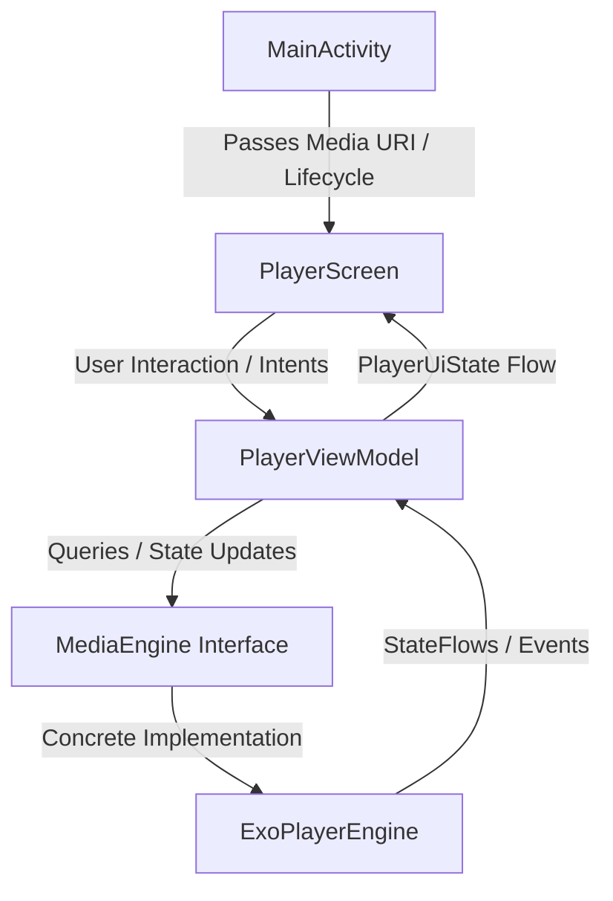
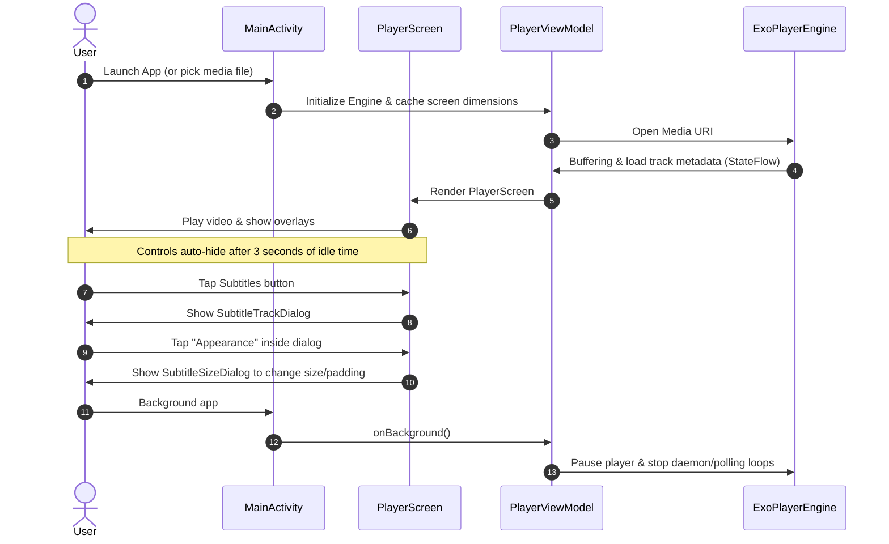

# Potato Player


A lightweight, modern, and premium Android video player built with **Jetpack Compose** and **AndroidX Media3 (ExoPlayer)**. Designed with a clean architecture, battery optimizations, and custom gesture controls.

---

## 🎨 Design & Aesthetics

Potato Player is designed with visual excellence and rich modern design principles in mind:

* **Harmonious Dark Theme**: Sleek dark interfaces tailored to look immersive and keep focus on the video content.
* **Modern Typography**: Clear font hierarchy using professional sans-serif scaling.
* **Micro-Animations & Smooth Gradients**: Controls fade gracefully with custom overlays, volume HUDs, and gesture feedback pills.
* **Clean dialog layouts**: Transparent overlays, radio listings, and custom sliders for premium configuration experience.

---

## 🏗️ Architecture Details

The project is built adhering to the **pure data-in / intent-out (MVI)** patterns. The layer boundaries are strictly defined, ensuring the media engine remains decoupled from the presentation logic:



### Key Architectural Layers

1. **System & Lifecycle (`MainActivity.kt`)**:
   * Manages entry intent Uri resolution and file pickers.
   * Controls system-level window flags (e.g., keeping screen active via WakeLocks, setting edge-to-edge UI).
   * Forwards foreground/background events to the ViewModel.
2. **Presentation Model (`PlayerViewModel.kt`)**:
   * Bridges the underlying media engine to Compose UI.
   * Maps detailed engine states into a unified, lightweight, immutable `PlayerUiState`.
   * Manages transient UI preferences like screen-size caching, auto-orientation triggers, and rotation locking.
3. **Core Abstraction (`MediaEngine.kt`)**:
   * A framework-neutral API defining standard media operations (`play`, `pause`, `seekTo`, `track selection`).
   * Designed to support drop-in alternatives (e.g., an FFmpeg-backed engine) without touching UI logic.
4. **Media Engine (`ExoPlayerEngine.kt`)**:
   * Media3 `ExoPlayer` implementation that manages decoders, buffers, tracks, and media lifecycle.
   * Translates native player exceptions into domain-specific `ErrorCode`s and filters raw tracks into UI-ready domain models.
5. **Decoupled Gesture Handler (`PlayerGestureHandler.kt`)**:
   * Logic-only gesture processor translating raw coordinates and drag deltas into volume levels, seek jumps, and playback speed adjustments.
   * Completely independent of Compose UI to allow unit testing.

---

## 🚀 Key Features

* **Adaptive Audio & Video Playback**: Fully leverages hardware-accelerated Media3 pipelines for high-performance rendering.
* **Intuitive Gestures**:
  * ⏩ **Double Tap to Seek**: Tap left/right thirds to skip 10 seconds backward or forward.
  * ⚡ **Long Press for 2× Speed**: Instant fast-forward on press, smoothly returning to normal speed on release.
  * 🔊 **Vertical Volume Drag**: Swipe vertically to change volume dynamically with a clean central HUD.
* **Track Customizations**:
  * Subtitle track switcher with default language configuration (e.g., English auto-selection).
  * Audio track selection supporting multi-language streams.
* **Subtitle Styling ("Appearance")**:
  * Adjust text size fraction and bottom padding offset directly through a modal slider.
  * Accessible from within the **Subtitles Selection dialog** via the "Appearance" option.
* **Auto-Orientation**:
  * Rotates screen based on video track aspect ratio (Portrait vs Landscape).
  * Manual override rotation lock button in the bottom controls bar.
* **Battery-Saving Optimizations**:
  * Polling rate throttle (increases update interval when idle, reduces during active scrubbing).
  * Stops rendering/polling on backgrounding or during paused buffering.

---

## 🔄 App Flow & Lifecycle



1. **Intent Resolution & Pickers**: The app resolves the intent URI or falls back to a document picker (`MissingMediaScreen`) to retrieve the media location.
2. **Playback Preparation**: The URI is sent to the ViewModel, which stops previous sessions, resets parameters, and calls `prepare()` on ExoPlayer.
3. **Controls Overlay Lifecycle**:
   * Interactive controls overlay hides after 3 seconds of active playback.
   * Tapping anywhere on the screen displays the controllers again.
   * Auto-hide is suppressed when dragging, seeking, or long-pressing.
4. **Subtitle Adjustments**: The user opens the subtitle selector, views available tracks, and taps **Appearance** to refine text sizing and placement.
5. **Safe Tear-down**: Upon pausing or backgrounding, system controls and daemons sleep, releasing native decoders safely to prevent resource leaks.

---

## 🛠️ Build & Development

## Support Development

If you find AnyFile Opener useful, consider supporting development:

<a href="https://buymeacoffee.com/tapman" target="_blank">
  
</a>

The project is built using Gradle. To generate the debug build:

```bash
# Build debug APK
./gradlew assembleDebug
```

The output APK will be generated at:
`app/build/outputs/apk/debug/app-debug.apk`
